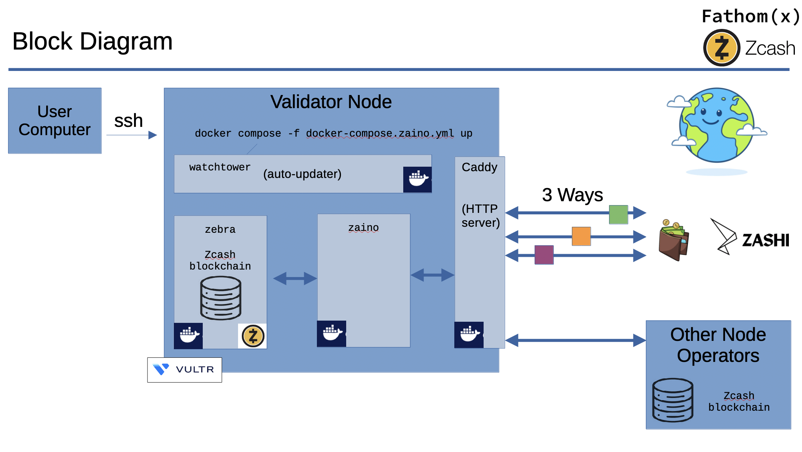

# Docker Zcash Light Wallet

## Overview of the Components


Zebra is an independent, Rust-based implementation of the Zcash node software, developed by the Zcash Foundation. It is designed for security, correctness, and performance. Zebra fully validates the Zcash blockchain, handles peer-to-peer networking, and implements consensus rules, making it suitable for running validator nodes and contributing to the decentralization and resilience of the Zcash network.

Zaino is a lightweight codebase in GO for building Zcash-related infrastructure. Its design emphasizes clear interfaces and extensibility, making it an interface between Zebra node software and lightwallets, auditing services, and other ecosystem tools.

Caddy is a modern, easy-to-use web server and reverse proxy that automatically manages HTTPS certificates. It will be used to securely expose our Zcash nodes to the internet with minimal configuration.

Watchtower is an automated tool for monitoring and updating running Docker containers. It ensures your Zcash node and related services stay up-to-date by automatically pulling and applying new container images with minimal downtime.

Zashi is a lightweight, open-source Zcash lightwallet app designed for privacy and ease of use. It could connect your own node to the Zcash blockchain, allowing you to manage Zcash funds securely from your desktop or mobile device.

## Install Docker on your server/VM and check out this source code repository.

```
git clone https://github.com/zecrocks/zcash-stack.git
cd zcash-stack/docker
docker compose up
# Or, try it with Zaino, the replacement for lightwalletd: (don't do both)
docker compose -f docker-compose.zaino.yml up
```

## Sync the Blockchain
### Lengthy Process
The blockchain will be synced into the ```data``` directory, which can be useful for copying it to other devices.

It will take several days to sync depending on the speed of your computer and internet connection.

### Spedy Process
In a hurry? We host a snapshot of the blockchain that you can download faster than synchronizing it from scratch. It's not the purest way to synchronize, but it can save you over a week - especially if you are on a slow device.

```
# Run this to download our blockchain snapshot, then run "docker compose up" after it is complete.
./download-snapshot.sh
```
## Connect your node to the world
To connect to it from a wallet, you'll need to expose lightwalletd's port to the world.

There are several ways to do this. The quickest is to use Tailscale Funnel or Cloudflare Tunnel.

For Cloudflare Tunnel, [after installing it](https://developers.cloudflare.com/cloudflare-one/connections/connect-networks/downloads/), run this:

```
cloudflared tunnel --url http://localhost:9067
```

This is a work in progres. More detailed instructions are on the way!
