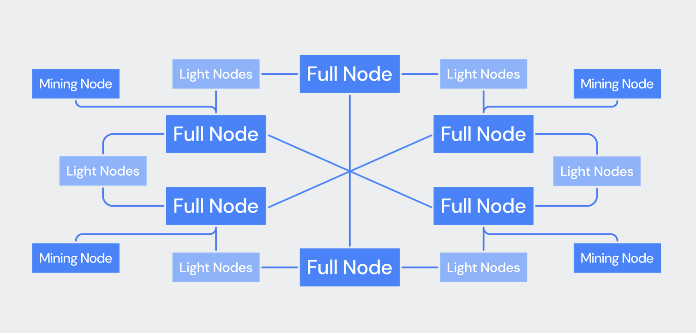
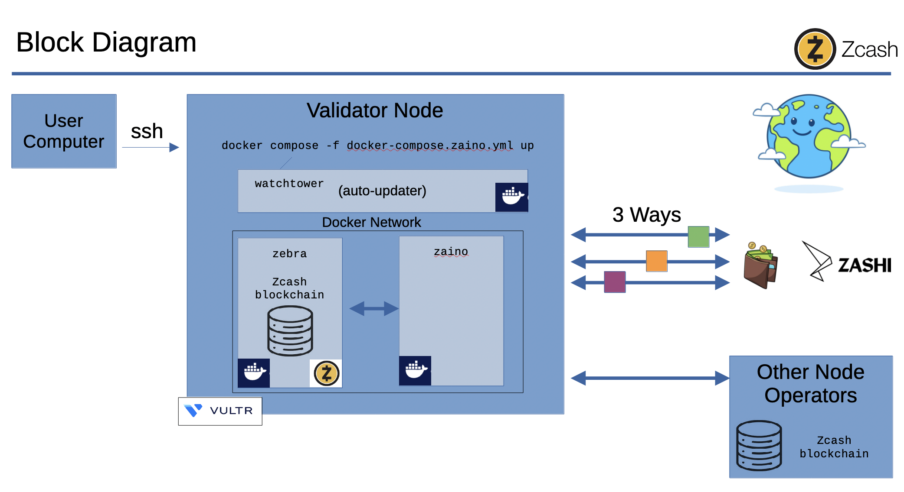

# Zcash Node Workshop: Sync week!

Welcome to class 1 of the Zcash Node Workshop!

This begins our documentation of the Zcash infrastructure stack. Whether you are an experienced blockchain node operator, miner, or a relative newbie to this ecosystem, we hope you'll learn something as you progress through this workshop.

> [!NOTE]
> Don't skip our [workshop overview](./README.md). :)

Please first review our ["before you begin"](./README.md#before-you-begin) section to ensure this workshop is appropriate for your skill level and intents. If they are, we hope you're as excited to help us expand and improve the Zcash ecosystem as we are to help you, because that's exactly what this workshop has you doing!

## Measure twice, cut once

Let's discuss some basic considerations for running Zcash infrastructure. In this section, you'll:

1. Learn _what_ it means to host a Zcash node.
1. Choose _where_ to host your Zcash node: externally, or self-hosted?
1. Decide _how_ to host your Zcash node: directly via Docker, or orchestrated with Kubernetes?

You'll end up in one of the four squares depicted by this table:

|                | External host    | Self-hosted   |
|----------------|------------------|---------------|
| **Docker**     | Easiest          | Cheapest      |
| **Kubernetes** | Quickly scalable | Most advanced |

You'll get no judgement from us regardless of which path you choose. The goal is to gain experienc and to help expand the Zcash ecosystem while having fun. You can start anywhere that feels comfortable. Once you outgrow that square, you can come back to this workshop and pick another starting point.

Remember, Zcash is decentralized software! You can completely delete it and start over fresh as many times as you like. You will not cause harm to the blockchain, as it is already synchronized across many computers around the world.

It also may be helpful to remember that, in this workshop, we will not be storing any money in our Zcash nodes. Instead, we are contributing to the decentralization of the network. We're not using its wallet functionality. That means you can safely try a few hosts out, along with both our Docker and Kubernetes approaches to really learn about hosting services! You can always reinstall and try again.

##  _What_ does it mean to host a Zcash "node"?

A *Zcash "node"* is the term for the primary infrastructure component in the Zcash network. They are called nodes because they make up a network of bidirectionally communicating networked software applications called *servers* that implement the [Zcash protocol specification](https://zips.z.cash/protocol/protocol.pdf).

### Types of Zcash nodes

Like many other blockchain consensus systems including Bitcoin, Zcash nodes can be deployed in a number of different configurations. Depending on how the server software is configured, a Zcash node is said to be one of a number of different types of nodes. Most commonly, you'll hear these described as "validators" because they perform the crucial function of verifying ("validating") transaction data and relaying that same transaction data to other (validating) nodes in order to both maintain a full copy of the Zcash blockchain ledger and contribute to the consensus process that secures the network's data. Another name for such a validator in the Zcash network is a *full node*.

Since validator nodes independently check the validity of new blocks and transactions according to the protocol rules, help propagate data to other nodes, and ensure the integrity and decentralization of the blockchain, they typically require reliable hardware, sufficient storage and bandwidth, and a secure, always-on internet connection in order to be seen as healthy participants in the ecosystem.

There are, of course, other types of nodes in the Zcash network. These include "light nodes," and "mining nodes." Light nodes are similar to full nodes but require less storage because they do not typically store all (or any) of the blockchain history, opting instead to simply relay transaction data to other nodes. Mining nodes are those which accept transaction data and perform the computations necessary to enshrine that data into the blockchain ledger through cryptographic means, writing new blocks that are then propagated back out to all other validating nodes.

In this workshop, we will be setting up a validating, full (non-mining) node.

## _Where_ will you host your Zcash node?

As discussed above, hosting a Zcash full node (or "validator") will require plenty of previously unused on-disk storage space, along with a highly available Internet connection and other compute resources to meaningfully participate in the network's operation. Put plainly, you'll need powerful enough server hardware to do the job well. Thankfully, there are plenty of options for just such a need.

As you probably know, servers are special computers made with high-quality components to help them function for long periods of time with no downtime. In some contexts, particularly when discussing *hardware*, servers are also called *machines* to distinguish them from the software "server" programs that are run on said hardware. While usually clear from context, we will make an effort to discuss server hardware as "machine hardware" and server software as "server applications."

### Contracting an external hosting provider

Many companies around the world offer machine hardware for rent, hosted in special buildings called datacenters which are built to provide reliable power, cooling, and security. These companies are called "hosts" or "hosting providers." At enterprise scale, such as that required by big tech companies, the hosting offerings are called "public clouds."

Renting an entire computer, a machine just for yourself, is called renting a "dedicated server" (or dedicated machine). This can prove luxurious, but is also often a little pricey.

You can also rent a portion of a machine for a much lower price. Computer chips today offer many security features that allow multiple people to share a computer safely, without being able to access or affect each other's information or apps. This capability is known as multi-tenancy. Renting a portion of a computer is called renting a "virtual machine" or "VM" for short.

For this workshop, we recommend [renting a VM in Google Cloud using the $300 of free credits that they give to new users](https://cloud.google.com/free/docs/free-cloud-features#free-trial). You can also use [Amazon AWS's (mostly) free tier](https://aws.amazon.com/free/), as the majority of hosting costs required to complete this workshop will be server compute resources. Alternatively, if you're feeling adventurous, check out the hundreds of options on [ServerHunter.com](https://serverhunter.com/).

Regardless of which hosting provider you choose, you'll want to somehow obtain a machine with access to no less than 400GB of disk space and at least 4GB of RAM that can be dedicated to the Zcash servers we're going to run there.

> [!TIP]
> If you need further assistance, chat with us on [Session](https://getsession.org/) before paying for something, we'll help you verify that it's a good option.

### Self-hosting Zcash

But computers are everywhere! You might even have an extra one or two (or, if you're anything like us, three) in your house. It can be fun to host useful things on computers in your house. Many people do this, even using multiple computers. It's called a "home lab!"

> [!TIP]
> If you're very excited by the idea of building a home lab, we recommend you have a look at [Proxmox](https://www.proxmox.com/). Using the Proxmox Virtual Environment, you can network multiple physical machines in your home together to create a virtualization platform similar to Amazon AWS's EC2 or Google GCP's GCE offering, complete with programmatic API access. In other words, Proxmox VE is a self-hostable, open source Infrastruture-as-a-Service platform that you can use to pool your physical machine's hardware capabilities and "rent" it back out to yourself very much like how Amazon and Google rents such resources back to you.

There are downsides to hosting something at home, however:
1. The computer needs to be online all of the time, never rebooting, which means that ideally it is also on a battery backup, called an uninterruptible power supply (or UPS for short).
1. You risk revealing information to the world about where you live, through IP address leaks.
1. If a hacker got access to your server, they could potentially access your home network unless you take precautions such as implementing at least [some basic network segmentation techniques](https://pcper.com/2016/08/steve-gibsons-three-router-solution-to-iot-insecurity/).
1. It can be a lot more work to build and maintain all the layers of the hardware stack yourself instead of relying on an external contractor to do it for you.

If you're comfortable with the risks, go for it! We're happy to help as numerous authors of this workshop run home labs ourselves!

## _How_ will your host a Zcash node?

Once you have suitable machine hardware available, you'll next need to choose how you're going to orchestrate all the software componentry that you'll run on that hardware.

Two different but related orchestration methods are popular with service administrators and system operators today. They are Docker and Kubernetes.

### Docker vs. Kubernetes: A showdown

- Docker (noun): a person who loads and unloads shipping containers at a marine dock
- [Docker](https://www.docker.com/) (noun): an open-source software project automating the deployment of applications inside software containers

vs

- Kubernetes (noun): Greek word meaning a helmsman or pilot responsible for steering a ship
- [Kubernetes](https://kubernetes.io/) (noun): an open-source system that automates the deployment, scaling, and management of containerized applications

The Zec.rocks infrastructure runs on dedicated machines that we maintain around the world, running Zcash servers on a lightweight Kubernetes distribution called [k3s](https://k3s.io/).

Our recommendation:

- If you are already familiar with Kubernetes or have managed fleets of servers in datacenters across the globe before, Kubernetes is probably the better choice for you.
- If you are a less experienced system operator or are newer to running services, we recommend starting with Docker because it offers both an easier entry point and can get you familiar with some of the basics you'll need to know for running a Kubernetes cluster down the road, anyway.

### Using Docker to host your Zcash node

Docker is a tool that packages program code along with everything they may need from an underlying operating system (like dependencies or lower-level system tools) into a standard format called a *container image* so that the "containerized" programs run the same regardless of which physical machine is hosting them. The name comes from the analogy of a shipping container, but for software: the container is isolated, portable, and easy to "ship" to another computer.

Each discrete piece of compiled software, called a *server binary*, is first packaged into and then run as its own container, as shown in the diagram below.

### Using Kubernetes to host your Zcash node

Kubernetes is a container orchestration system that runs lots of containers across multiple computers and makes sure that the software stays online, even if some of the computers stop working. It can even grow and shrink automatically throughout the day. If more people need the software, it adds more compute resources and ships containerized software to them autonomously; if fewer people use it, it removes the extra resources and containers to save on costs.

The major public clouds have managed Kubernetes platforms which offer many cool features but they can be a bit expensive, and are centralized. If you're okay with that, try [Google Kubernetes Engine (GKE)](https://cloud.google.com/kubernetes-engine).

Of course, Kubernetes itself can be self-hosted, too, so you don't have to run it on a major public cloud. You can run it yourself, even on one computer, even in your home lab. You'll lose the benefits of a large company's reliability if you do this, but you gain independence, and a lot of good experience.

## Notes on synchronizing the Zcash blockchain

The Zcash blockchain is large (~350GB at the time of this writing), and growing the more it is used. It can take over a week to download and synchronize all of it to your node depending on your available network bandwidth and other resources. Through this process, your new server will validate each transcation in the blockchain, which can be a lengthy process.

To speed this process up, another option is to download a snapshot of the blockchain as a starting point and then let the server validate each new subsequent transcation. Of course, this assumes that the snapshot maker has an accurate copy of the history of the blockchain, but don't worry. If an inaccurate or malicious snapshot is used, subsequent blocks won't validate correctly, you'll be alerted, and you won't harm the rest of the network, although you will have to start over and download a different snapshot, one that's hopefully not inaccurate this time!

If you'd like to do that, you can download a snapshot of the Zcash blockchain, which will likely takesa few hours, by running [the `download-snapshot.sh` script we provde here](../docker/download-snapshot.sh).

## Next steps:

1. Procure your hardware if you haven't already!
1. Launch the Zcash servers to create your new node:
    - Want to use the Docker method? Continue reading at [Docker process](../docker/README.md).
    - Want to use the Kubernetes method? Continue reading at [Kubernetes process](../charts/zcash-stack/README.md).
1. After launching your Zcash servers, proceed to [Zcash Node Workshop: Class 2](./class-2-connect.md).
