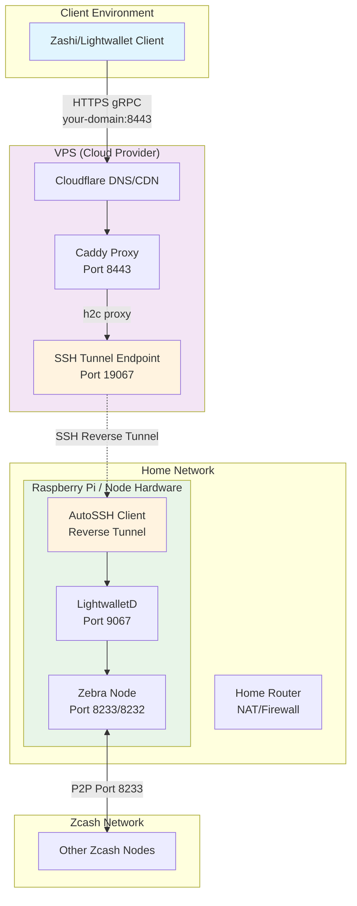

# Connect via SSH tunnel on a VPS proxy

For robust IP obfuscation, one approach is using a VPS (Virtual Private Server) as a proxy gateway. This architecture allows you to run your Zcash node on a home network (like a Raspberry Pi) while exposing it to the internet through a separate VPS, hiding your home IP address from the lightwallet clients (but note that the IP address will still be visible to other zcash nodes).

#### Architecture Overview



#### Why This Architecture?

This setup provides several advantages:

1. **IP Privacy**: Your home IP address is hidden from clients
2. **NAT/Firewall Bypass**: No need to configure port forwarding on your home router
3. **Geographic Distribution**: You can choose VPS locations different from your home
4. **Cost Effective**: Small VPS instances are sufficient since they only proxy traffic

#### Prerequisites

Before setting up the VPS proxy, you'll need:

1. **VPS Instance**: A small cloud VPS (1GB RAM, 1 vCPU is sufficient)
2. **Domain Name**: A domain you control (for SSL certificates)
3. **Cloudflare Account**: Free account for DNS (and SSL management)
4. **SSH Key Pair**: For secure authentication between your node and VPS

Generate SSH keys if you don't have them:
```bash
# On your home node (Raspberry Pi)
ssh-keygen -t ed25519 -f ~/autossh-keys/id_ed25519 -N ""

# Copy the public key to your VPS
ssh-copy-id -i ~/autossh-keys/id_ed25519.pub root@YOUR_VPS_IP
```

#### Home Node Configuration

On your home node (Raspberry Pi or similar), you'll run two main services. All configuration files are available in the [`docker/`](../docker/) directory.

**1. Main Zcash Stack**

Use the correct docker configuration: 

- ARM: [`compose.arm.yaml`](../docker/compose.arm.yaml)
- x86_64: [`compose.yaml`](../docker/compose.yaml)

For VPS proxy setup, you'll need to modify the port bindings:

1. **Edit the file to enable VPS mode:**
   - Comment out the public port bindings (`9067:9067` and `9068:9068`)
   - Uncomment the localhost-only bindings (`127.0.0.1:9067:9067` and `127.0.0.1:9068:9068`)

The file includes comments showing exactly which lines to change for VPS setup.

**2. AutoSSH Reverse Tunnel**

Use: [`compose.autossh.yaml`](../docker/compose.autossh.yaml)

Configure your VPS details in a `.env` file:
```bash
# .env file
VPS_IP=YOUR_VPS_IP_ADDRESS
```

Start both services:
```bash
cd docker/                                         # From the `docker/` directory...
docker compose -f compose.arm.yaml up --detach     # ...start the main Zcash stack (after editing for VPS mode)
docker compose -f compose.autossh.yaml up --detach # ...start the SSH tunnel (in a separate terminal/screen)
```

#### VPS Configuration

On your VPS, use the Caddy reverse proxy configuration: [`compose.vps.yaml`](../docker/compose.vps.yaml)

This setup includes:
- **Caddy with Cloudflare integration** for automatic SSL certificates
- **Health monitoring** of the SSH tunnel connection
- **Environment variable configuration** for easy deployment

Configure your VPS with a `.env` file:
```bash
# VPS .env file
CLOUDFLARE_API_TOKEN=your_cloudflare_token_here
DOMAIN_NAME=your-domain.com
```

Deploy on your VPS:
```bash
# On your VPS
docker compose -f compose.vps.yaml up --detach
```

#### Testing Your Setup

Once everything is running, test your setup with `grpcurl`:

```bash
grpcurl -authority your-domain.com \
  -d '{}' \
  your-domain.com:8443 \
  cash.z.wallet.sdk.rpc.CompactTxStreamer/GetLightdInfo
```

Expected response:
```json
{
  "vendor": "ECC LightWalletD",
  "taddrSupport": true,
  "chainName": "main",
  "saplingActivationHeight": "419200",
  "consensusBranchId": "c8e71055",
  "blockHeight": "3065090",
  "buildDate": "2025-09-10",
  "buildUser": "root",
  "estimatedHeight": "3065090",
  "zcashdBuild": "v2.5.0",
  "zcashdSubversion": "/Zebra:2.5.0/"
}
```
