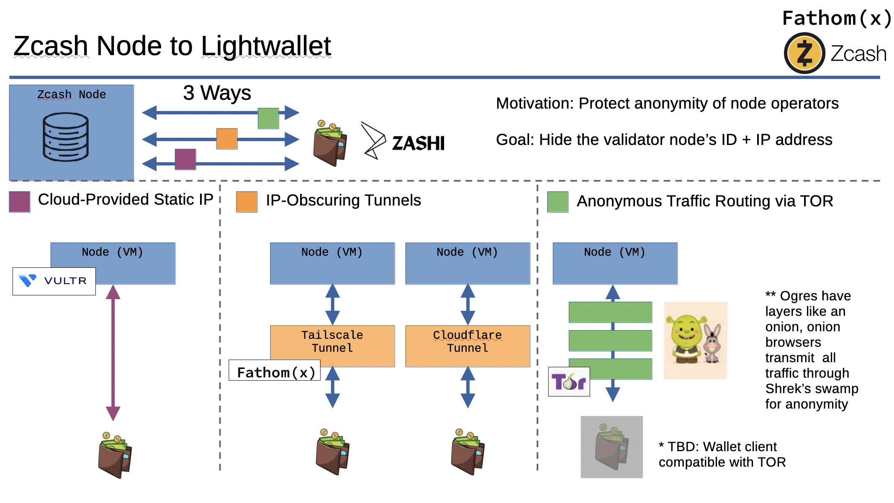

# Welcome to the Zcash Node Workshop: Connect Week!

## Workshop TLDR
1. Set up a VM on hardware of choice
1. Launch the containers via Docker or Kubernetes on your VM
    - Clone the git repo (https://github.com/zecrocks/zcash-stack)
    - Or our competitors (https://github.com/stakeholdrs/zcash-infra)
1. Sync the blockchain (from scratch in ~10 days or from download-snapshot.sh in ~10 hours)
1. Connect your new node to a wallet (perhaps using Cloudflare or Tailscale tunnel)
1. Sit back and sip a Red Bull knowing you are providing diversity and reliability to the privacy-coin Zcash ecosystem

This week covers #4 + #5.

## Table of Contents
- [Action Item 4: Connect your Server to a Lightwallet](#action-item-4-connect-your-server-to-a-lightwallet)
  - [Public Operation](#public-operation-cloud-provided-static-ip-address)
  - [IP-Obscured Operation](#ip-obscured-operation)
  - [Anonymous Traffic Routing](#anonymous-traffic-routing)
- [Action Item 5: Relax](#relax)

## Connecting your Server to the World Wide Web3

Let's talk about personal privacy and shielding IP address. Now that we have a server running, we will want to connect it to the outside world so that clients can make use of it.

In brief, there are more or less three different broad approaches you may want to take when operating a service. In this workshop, we will call these:

1. Public operation: Reveals information about the operator
1. IP-Obscured operation: Hides information about the operator from casual observers
1. Anonymizing operation: Attempts to hide as much information about the operator from all possible observers



Note that even when operating in an anonymizing manner, it is difficult to protect some potentially revealing information from the most dedicated adversaries. Please audit your running configuration before relying on it to protect your liberty.

## 1. Public operation (cloud-provided static IP address)

Whenever you operate a service like this, you often reveal information about yourself to the world. You can think of operating a service similarly as "publishing information about" a service and, in fact, this is often how system operators speak of running publicly available services such as this.

In some use cases, you may not have any concern about publishing information about yourself in such a manner. If this is true for you, you can simply point your lightwallet client to the publicly exposed ("published") port of your Zaino (lightwallet server) at the static IP address that you are hosting it at. This means connecting clients will know your clearnet (unencrypted Internet) public IP address.

Simply bringing `up` the default configurations shared in this workshop is enough to make your validator and lightwallet server addresses available to the public.

If you're hosting your service on a cloud provider like Google Cloud or Vultr, they will supply an IP address (separate from your home IP address) which can be directly connected to from a lightwallet. At least this way, your home is still protected because the service is not operating in your domicile. This provides some protection, and is the simplest method to publish your service to the world, but does nothing to protect information about the service itself.

## 2. IP-Obscured Operation

In many cases, system operators don't want to reveal who they are to everyone in the whole world. In these cases, you may find yourself wanting to obscure the IP address of the service from the public. If you do this, then You can for example choose to allow only certain people access to use your service.

This requires configuring your service to operate in an IP-obscured fashion, such that we aren't revealing certain information about ourselves. One helpful analogy may be to think of public operation similarly to how older generations shipped massive books of phone numbers and addresses to every resident in the neighborhood; we don't want to broadcast our IP address and other personal information out to every resident of the Internet.

For this, you can make use of various IP-obscuring tunnel technologies. Two popular and effective ones are [Cloudflare](https://developers.cloudflare.com/cloudflare-one/connections/connect-networks/) and [Tailscale](https://tailscale.com/kb/1223/funnel), which  both offer tunneling technology that let you route traffic from the broader internet to a local server while also providing some measure of IP address obfuscation to the broader world.

When you use an IP-obscured method for your own privacy, you should remove the direct/static method from your service so that only the more private avenue exists. You can also choose to add this more private method *in addition to* the less private one if you simply need different capabilities or are using these avenues for censorship circumvention rather than for privacy, per se.

Direct/static method in docker-compose.zaino.yml:
```
zaino: 
    ...
  ports:
    - "0.0.0.0:8137:8137" # GRPC port for lightwallet client connections.
```

[TODO: Add information on setting up cloudflare]

## 3. Anonymous Traffic Routing


Shrek has layers like an onion. Onion browsers like [TOR](https://www.torproject.org/), route traffic through a series of servers. Like wading through Shrek's swamp, this removes any traces of the path from origin to destination. Like a game of telephone, the packets are passed from node to node, each time stripping off information from its past. Unlike a game of telephone, the original message arrives encrypted and intact.

> [!NOTE]
> Currently no publicly available lightwallets support Tor's Onion addresses. (April 2025)

## Lightwallet Node Discovery

[TODO: Insert discussion of how lightwallets find the IP addresses of new nodes?]

## Example: Connecting to Zashi + Test Transcation

To manually test of your node is synced and working, you can add it to a Zashi wallet.
```
Gear Icon -> Advanced Settings -> Choose a Server -> custom
```

Enter your new IP address into the custom server field and test a transcation!

Send a tip to your favorite Zcash node workshop organizer. ;)  

ReadyMouse: u14yr5fr2gzhedzrlmymtjp8jqsdryh6zpypnh8k2e2hq9z6jluz9hn9u088j02c3zphnf30he4pnm62ccyae6hfjjuqxlddhezw2te5p6xxhm68vvvpvynnzdcegq4c5u06slq673emarwjy5z0enj2ry53avx0nsmftpx4hhh5rhpgnc

OR 

Support Tech Learning Collective's (TLC) Mission to provide cybersecurity and crypto literacy to at-risk minorities, and vulnerable communities whose livelihoods depend on privacy. TLC educates those whose very ability to transact in the world is threatened as a result of their identity, legal status, or occupation.

[Tech Learning Collective](https://techlearningcollective.com/workshops/Two-Sides-of-the-Same-Coin-Transacting-Privately-with-Cryptocurrency)

TLC: 
[TODO: Insert sheilded address]

If you leave a way to contact you in the encrypted message field, and we'll acknowledge the transcation with a big thanks!

## Action Item 5: Relax
