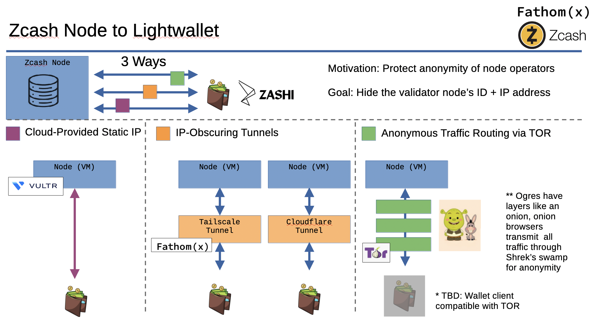
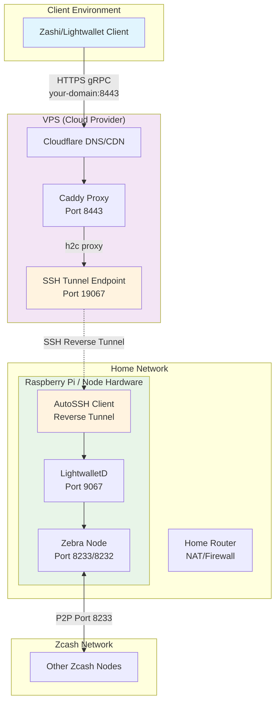

# Welcome to the Zcash Node Workshop: Connect Week!

This continues our dicussion of hosting a zcash full node. If you are just starting here, perhaps you missed the [workshop overview](./README.md). 

## Workshop TLDR
1. [Sync](./class-1-sync.md) - Initial set up:
    1. Set up a virtual machine (VM) on hardware of your choice.
    1. Launch the Zcash service containers via Docker or Kubernetes on your VM.
        - Clone our [workshop Git repository](https://github.com/zecrocks/zcash-stack).
        - Or [our friendly-competitor's repository](https://github.com/stakeholdrs/zcash-infra).
    1. Synchronize your node with the Zcash network's blockchain (from scratch in ~10 days or from [`download-snapshot.sh`](../docker/download-snapshot.sh) in ~10 hours).
1. **Connect** - Connect your node to the Zcash network.
    - Optionally, use one of several technologies to improve the privacy that you, as a node operator, have for running your node and to connecting clients.
1. [Observe](./class-3-observe.md) - Observe, monitor, and maintain your Zcash infrastructure to ensure your node remains reliably available as part of the network.

This document covers Connect.

## Table of Contents
- [Connecting your Server to the World Wide Web3](#connecting-your-server-to-the-world-wide-web3)
  - [1. Public operation (cloud-provided static IP address)](#1-public-operation-cloud-provided-static-ip-address)
  - [2. IP-Obscured Operation](#2-ip-obscured-operation)
  - [3. Anonymous Traffic Routing](#3-anonymous-traffic-routing)
- [Lightwallet Node Discovery](#lightwallet-node-discovery)
- [Example: Connecting to Zashi + Test Transcation](#example-connecting-to-zashi--test-transcation)
- [Relax](#relax)

## Connecting your Server to the World Wide Web3

Let's talk about personal privacy and shielding IP address. Now that we have a server running, we will want to connect it to the outside world so that clients can make use of it.

In brief, there are more or less three different broad approaches you may want to take when operating a service. In this workshop, we will call these:

1. Public operation: Reveals information about the operator
1. IP-Obscured operation: Hides information about the operator from casual observers
1. Anonymizing operation: Attempts to hide as much information about the operator from all possible observers



Note that even when operating in an anonymizing manner, it is difficult to protect some potentially revealing information from the most dedicated adversaries. Please audit your running configuration before relying on it to protect your liberty.

## 1. Public operation (cloud-provided static IP address)

Whenever you operate a service like this, you often reveal information about yourself to the world. You can think of operating a service similarly as "publishing information about" a service and, in fact, this is often how system operators speak of running publicly available services such as this.

In some use cases, you may not have any concern about publishing information about yourself in such a manner. If this is true for you, you can simply point your lightwallet client to the publicly exposed ("published") port of your Zaino (lightwallet server) at the static IP address that you are hosting it at. This means connecting clients will know your clearnet (unencrypted Internet) public IP address.

Simply bringing `up` the default configurations shared in this workshop is enough to make your validator and lightwallet server addresses available to the public.

If you're hosting your service on a cloud provider like Google Cloud or Vultr, they will supply an IP address (separate from your home IP address) which can be directly connected to from a lightwallet. At least this way, your home is still protected because the service is not operating in your domicile. This provides some protection, and is the simplest method to publish your service to the world, but does nothing to protect information about the service itself.

## 2. IP-Obscured Operation

In many cases, system operators don't want to reveal who they are to everyone in the whole world. In these cases, you may find yourself wanting to obscure the IP address of the service from the public. If you do this, then You can for example choose to allow only certain people access to use your service.

This requires configuring your service to operate in an IP-obscured fashion, such that we aren't revealing certain information about ourselves. One helpful analogy may be to think of public operation similarly to how older generations shipped massive books of phone numbers and addresses to every resident in the neighborhood; we don't want to broadcast our IP address and other personal information out to every resident of the Internet.

For this, you can make use of various IP-obscuring tunnel technologies. [Tailscale](https://tailscale.com/kb/1223/funnel) offers tunneling technology that let you route traffic from the broader internet to a local server while also providing some measure of IP address obfuscation to the broader world.

### VPS Proxy Setup 

For robust IP obfuscation, One approach is using a VPS (Virtual Private Server) as a proxy gateway. This architecture allows you to run your Zcash node on a home network (like a Raspberry Pi) while exposing it to the internet through a separate VPS, hiding your home IP address from the lightwallet clients (but note that the IP address will still be visible to other zcash nodes).

#### Architecture Overview



#### Why This Architecture?

This setup provides several advantages:

1. **IP Privacy**: Your home IP address is hidden from clients
2. **NAT/Firewall Bypass**: No need to configure port forwarding on your home router
3. **Geographic Distribution**: You can choose VPS locations different from your home
4. **Cost Effective**: Small VPS instances are sufficient since they only proxy traffic

#### Prerequisites

Before setting up the VPS proxy, you'll need:

1. **VPS Instance**: A small cloud VPS (1GB RAM, 1 vCPU is sufficient)
2. **Domain Name**: A domain you control (for SSL certificates)
3. **Cloudflare Account**: Free account for DNS (and SSL management)
4. **SSH Key Pair**: For secure authentication between your node and VPS

Generate SSH keys if you don't have them:
```bash
# On your home node (Raspberry Pi)
ssh-keygen -t ed25519 -f ~/autossh-keys/id_ed25519 -N ""

# Copy the public key to your VPS
ssh-copy-id -i ~/autossh-keys/id_ed25519.pub root@YOUR_VPS_IP
```

#### Home Node Configuration

On your home node (Raspberry Pi or similar), you'll run two main services. All configuration files are available in the [`docker/`](../docker/) directory.

**1. Main Zcash Stack**

Use the correct docker configuration: 

- ARM: [`docker-compose.arm.yml`](../docker/docker-compose.arm.yml)
- x86_64: [`docker-compose.yml`](../docker/docker-compose.yml)

For VPS proxy setup, you'll need to modify the port bindings:

1. **Edit the file to enable VPS mode:**
   - Comment out the public port bindings (`9067:9067` and `9068:9068`)
   - Uncomment the localhost-only bindings (`127.0.0.1:9067:9067` and `127.0.0.1:9068:9068`)

The file includes comments showing exactly which lines to change for VPS setup.

**2. AutoSSH Reverse Tunnel**

Use: [`docker-compose.autossh.yml`](../docker/docker-compose.autossh.yml)

Configure your VPS details in a `.env` file:
```bash
# .env file
VPS_IP=YOUR_VPS_IP_ADDRESS
```

Start both services:
```bash
# Start the main Zcash stack (after editing for VPS mode)
docker-compose -f docker/docker-compose.arm.yml up -d

# Start the SSH tunnel (in a separate terminal/screen)
docker-compose -f docker/docker-compose.autossh.yml up -d
```

#### VPS Configuration

On your VPS, use the Caddy reverse proxy configuration: [`docker-compose.vps.yml`](../docker/docker-compose.vps.yml)

This setup includes:
- **Caddy with Cloudflare integration** for automatic SSL certificates
- **Health monitoring** of the SSH tunnel connection
- **Environment variable configuration** for easy deployment

Configure your VPS with a `.env` file:
```bash
# VPS .env file
CLOUDFLARE_API_TOKEN=your_cloudflare_token_here
DOMAIN_NAME=your-domain.com
```

Deploy on your VPS:
```bash
# On your VPS
docker-compose -f docker-compose.vps.yml up -d
```

#### Testing Your Setup

Once everything is running, test your setup with grpcurl:

```bash
grpcurl -authority your-domain.com \
  -d '{}' \
  your-domain.com:8443 \
  cash.z.wallet.sdk.rpc.CompactTxStreamer/GetLightdInfo
```

Expected response:
```json
{
  "vendor": "ECC LightWalletD",
  "taddrSupport": true,
  "chainName": "main",
  "saplingActivationHeight": "419200",
  "consensusBranchId": "c8e71055",
  "blockHeight": "3065090",
  "buildDate": "2025-09-10",
  "buildUser": "root",
  "estimatedHeight": "3065090",
  "zcashdBuild": "v2.5.0",
  "zcashdSubversion": "/Zebra:2.5.0/"
}
```

### Removing Direct Access

When you use an IP-obscured method for your own privacy, you should remove the direct/static method from your service so that only the more private avenue exists. You can also choose to add this more private method *in addition to* the less private one if you simply need different capabilities or are using these avenues for censorship circumvention rather than for privacy, per se.

Direct/static method in docker-compose.zaino.yml:
```
zaino:
    ...
  ports:
    - "0.0.0.0:8137:8137" # GRPC port for lightwallet client connections.
```

## 3. Anonymous Traffic Routing


Shrek has layers like an onion. Onion browsers like [TOR](https://www.torproject.org/), route traffic through a series of servers. Like wading through Shrek's swamp, this removes any traces of the path from origin to destination. Like a game of telephone, the packets are passed from node to node, each time stripping off information from its past. Unlike a game of telephone, the original message arrives encrypted and intact.

> [!NOTE]
> Currently no publicly available lightwallets support Tor's Onion addresses. (April 2025)

## Lightwallet Node Discovery

Currently Zashi maintains a list of the domains/IP addresses of known nodes, and manually adds trusted sources. 

## Example: Connecting to Zashi + Test Transcation

To manually test of your node is synced and working, you can add it to a Zashi wallet.
```
Gear Icon -> Advanced Settings -> Choose a Server -> custom
```

Enter your new IP address into the custom server field and test a transcation!

Send a tip to your favorite Zcash node workshop organizer. ;)  

ReadyMouse: u14yr5fr2gzhedzrlmymtjp8jqsdryh6zpypnh8k2e2hq9z6jluz9hn9u088j02c3zphnf30he4pnm62ccyae6hfjjuqxlddhezw2te5p6xxhm68vvvpvynnzdcegq4c5u06slq673emarwjy5z0enj2ry53avx0nsmftpx4hhh5rhpgnc

If you leave a way to contact you in the encrypted message field, and we'll acknowledge the transcation with a big thanks!

## Relax
